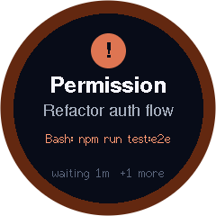
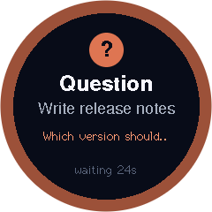
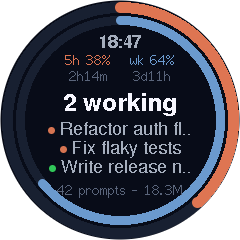
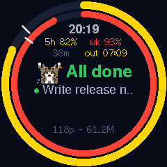
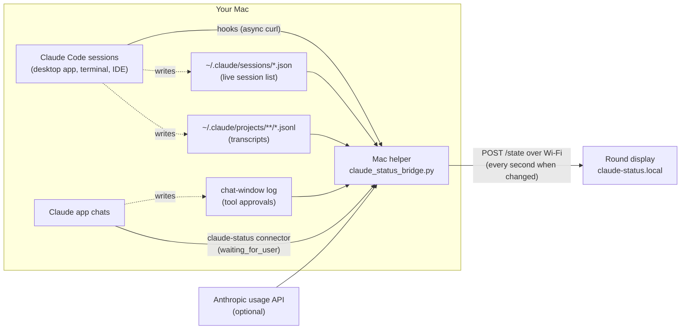
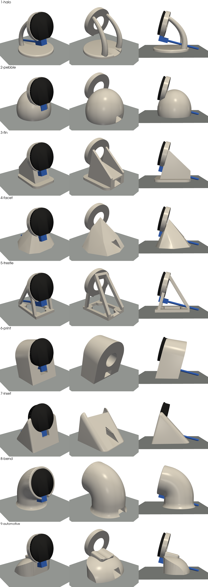

# Waveshare ESP32 Claude Monitor

A tiny round desk display that tells you what [Claude Code](https://claude.com/claude-code) is up to, and taps you on the shoulder the moment it needs you. 👋

When a session is waiting for a permission, an answer or a plan approval, the screen lights up with a pulsing orange ring so you never leave Claude sitting idle. The rest of the time it shows which sessions are working, how much of your plan you've used, and what you've got done today.

<p align="center">
  
  &nbsp;
  
  &nbsp;
  
  &nbsp;
  
</p>

<p align="center"><sub>Real screenshots, grabbed straight off the device (with made-up session names).</sub></p>

<p align="center"><b><a href="#install">⬇️ Install it: three ways, easiest first</a></b></p>

---

## Contents

- [What it shows](#what-it-shows)
- [What you'll need](#what-youll-need)
- [How it works](#how-it-works)
- [Install](#install)
  - [Option 1: Let Claude set it up (easiest)](#option-1-let-claude-set-it-up-easiest)
  - [Option 2: Download the installer (no coding)](#option-2-download-the-installer-no-coding)
  - [Option 3: Build it yourself, step by step](#option-3-build-it-yourself-step-by-step)
- [Reading the screen](#reading-the-screen)
- [Configuration](#configuration)
- [Troubleshooting](#troubleshooting)
- [Privacy: what it reads and where data goes](#privacy-what-it-reads-and-where-data-goes)
- [Uninstalling](#uninstalling)
- [Also in this repo](#also-in-this-repo)
- [Project layout](#project-layout)
- [Credits](#credits)

---

## What it shows

**🟠 When Claude needs you**, the whole screen becomes an alert:

- **What kind of request it is:** *Permission*, *Question*, *Plan ready* or *Needs input*
- **Which session** is asking, by name
- **What it wants**, e.g. `Bash: npm run test:e2e`, or the question Claude is asking
- **How long it's been waiting**, and how many other sessions are waiting too

The alert clears itself as soon as you respond. You don't need to touch the device.

**⚪ The rest of the time**, you get a calm status screen:

- 🕐 The current time
- 🔶 **5-hour plan usage** (outer ring) and 🔷 **weekly plan usage** (inner ring), each with a countdown to its reset
- **How many sessions are working**, plus up to three active ones, each with a status dot
- 📊 **Today's activity**: prompts sent and tokens processed, across every session

It works with every Claude Code session on your Mac: the desktop app, the terminal and IDE extensions. It can also alert you when a **regular chat in the Claude app** needs you, either to approve a connector or tool, or to answer a question Claude has asked (see [step 7](#7-optional-alerts-for-claude-app-chats)).

---

## What you'll need

| | |
|---|---|
| 🖥️ **The display** | [Waveshare ESP32-S3-LCD-1.28](https://www.waveshare.com/wiki/ESP32-S3-LCD-1.28): an ESP32-S3 with a 1.28" 240×240 round screen (GC9A01). The version with the CNC metal case ("-B") looks great on a desk. Get the **non-touch** version; the touch version uses different pins. |
| 🔌 **A USB-C cable** | For flashing, and for power afterwards. Once it's set up, any USB phone charger will do. |
| 🍎 **A Mac** | Running Claude Code. The helper uses `launchd` and the macOS Keychain. |
| 📶 **2.4 GHz Wi-Fi** | The ESP32 can't join 5 GHz-only networks. |
| 🌐 **Chrome or Edge** | For the one-click firmware installer. Safari and Firefox can't talk to USB devices. |
| 🐍 **Python 3** | For the Mac helper. macOS has it once Apple's Command Line Tools are installed; the installer offers to install them if needed. |
| 🛠️ **[PlatformIO](https://platformio.org/install/cli)** | *Developers only*, to build the firmware yourself: `brew install platformio` |
| 🖨️ **Optional: a 3D printer** | To print a [desk stand](#-stand-3d-printable-desk-stands). You'll also want a right-angle USB-C cable. Four 8 × 2 mm button magnets are optional, if you'd like to stick the stand to a metal surface. |

---

## How it works



There are three main moving parts, plus an extra for chats:

1. **Claude Code hooks** fire on events like *permission requested*, *question asked*, *tool finished* and *turn finished*. Each hook is a tiny background `curl` that forwards the event to the helper on `127.0.0.1`. The hooks are async, so they never slow Claude down, and they quietly do nothing if the helper isn't running.
2. **The Mac helper** (`claude-status/bridge/claude_status_bridge.py`) merges three sources into one small JSON summary:
   - **the hook events**, to work out who's waiting for you
   - **`~/.claude/sessions/`**, for which sessions are open and whether each is busy or idle
   - **your transcripts**, for today's token and prompt totals

   If you turn it on, it also checks your plan usage with Anthropic. It pushes the summary to the display whenever something changes, plus a heartbeat every 10 seconds.
3. **The display firmware** (`claude-status/firmware/`) joins your Wi-Fi and announces itself as `claude-status.local`. It accepts the summary on `POST /state` and draws the right screen at about 30 fps.
4. **Chats in the Claude app** don't have hooks, so the helper uses two other signals. It watches the app's chat-window log for **tool approval prompts**. A tiny local **connector** (`chat_mcp.py`) also gives Claude a `waiting_for_user` tool, which it calls when a reply ends with a question for you.

---

## Install

There are three ways to install, easiest first:

| | Best for | You'll need |
|---|---|---|
| 🤖 **[Option 1: Let Claude set it up](#option-1-let-claude-set-it-up-easiest)** | Anyone who uses Claude Code | Claude Code: the Claude app's **Code** tab, or `claude` in a terminal |
| ⬇️ **[Option 2: Download the installer](#option-2-download-the-installer-no-coding)** | No coding, and no Claude Code needed | Google Chrome or Microsoft Edge |
| 🛠️ **[Option 3: Build it yourself](#option-3-build-it-yourself-step-by-step)** | Developers who want to change the code | PlatformIO and a terminal |

All three need the display, a USB-C **data** cable (many charging-only cables won't work) and a Mac.

---

## Option 1: Let Claude set it up (easiest)

Claude Code does the whole setup for you, using the [setup skill](.claude/skills/setup-claude-monitor/SKILL.md) included in this project:
- it checks your Mac and installs the tools it needs
- it flashes the display and walks you through Wi-Fi on your phone
- it sets up your Mac and tests everything end to end

It stops and tells you whenever a step needs you, such as clicking **Always Allow** on a Keychain prompt.

1. **Get the project.** Download **Source code (zip)** from the [latest release](https://github.com/boujois/waveshare-esp32-claude-monitor/releases/latest) and double-click it to unzip. If you use git, you can clone it instead:
   ```bash
   git clone https://github.com/boujois/waveshare-esp32-claude-monitor.git
   ```
2. **Plug the display into your Mac** with the USB-C cable.
3. **Open the folder in Claude Code:**
   - **Claude app:** open the **Code** tab and choose the unzipped folder as the project.
   - **Terminal:** `cd` into the folder and run `claude`.
4. **Say *"set up the display"*,** or type `/setup-claude-monitor`, then follow along.

Allow about 10 minutes. Claude flashes the published firmware, the same files as Option 2, so there's nothing to build unless you ask it to build from source. The rest follows the same steps as [Option 3](#option-3-build-it-yourself-step-by-step), so you can read along there.

---

## Option 2: Download the installer (no coding)

No coding, no command line, about 10 minutes. Use **Google Chrome** or **Microsoft Edge** for step 1.

### 1. Put the software on the display

Open the **[Claude Monitor installer](https://boujois.github.io/waveshare-esp32-claude-monitor/)** in Chrome or Edge. Plug the display into your computer, click **Install Claude Monitor**, choose the display from the list, then click **Install**. It takes about a minute.

<details>
<summary><b>The installer page doesn't open?</b> Use Espressif's web flasher instead</summary>

1. Download **`claude-monitor-firmware.bin`** from the [latest release](https://github.com/boujois/waveshare-esp32-claude-monitor/releases/latest).
2. Open [Espressif's web flasher](https://espressif.github.io/esptool-js/) in Chrome or Edge.
3. Click **Connect** and choose the display.
4. Set **Flash Address** to `0x0`, choose the `.bin` file, then click **Program**.
5. When it's done, unplug the display and plug it back in.
</details>

### 2. Connect the display to your Wi-Fi

The display now shows **Wi-Fi setup** with a QR code. On your phone, scan the code, or join the Wi-Fi network **`Claude-Monitor-Setup`**. A page pops up: pick your home Wi-Fi, type its password, and tap **Save**. The display connects and shows **"Waiting for Mac"**.

> 📶 The display only works with **2.4 GHz** Wi-Fi. If the page doesn't pop up, open `192.168.4.1` in your phone's browser.

**To change Wi-Fi later**, do any of these:
- unplug the display and plug it back in **3 times in a row**, each within 10 seconds of the last; the second time, it reminds you to do it once more
- run `curl -X POST http://claude-status.local/wifi/reset` on your Mac
- hold the **BOOT** button for 5 seconds, if your case leaves it reachable

If the display can't find its saved Wi-Fi, for example after moving house, it opens setup by itself.

### 3. Set up your Mac

1. Download **`Claude-Monitor-Mac.zip`** from the [latest release](https://github.com/boujois/waveshare-esp32-claude-monitor/releases/latest) and double-click it to unzip.
2. In the **Claude Monitor** folder, **right-click `Install.command` and choose Open**. macOS blocks double-clicking downloaded scripts the first time. If it still refuses, open **System Settings → Privacy & Security** and click **Open Anyway**.
3. Answer the questions in the window that opens. It asks before restarting the Claude app, and before turning on plan usage.
4. For chat questions, the installer copies one sentence to your clipboard. Paste it into **Claude → Settings → Profile → personal preferences**.

Within a few seconds the display switches to your Claude status. To remove everything later, right-click **`Uninstall.command`** and choose **Open**.

---

## Option 3: Build it yourself, step by step

For developers, or anyone who wants to see every step. Allow about 15 minutes. Most of that is PlatformIO downloading the ESP32 toolchain the first time.

### 1. Clone the repo

```bash
git clone https://github.com/boujois/waveshare-esp32-claude-monitor.git
cd waveshare-esp32-claude-monitor
```

### 2. Wi-Fi (optional for development)

You don't need to put your Wi-Fi details in the code: after flashing, set up Wi-Fi from your phone as in [Option 2, step 2](#2-connect-the-display-to-your-wi-fi). The display remembers it across re-flashes.

If you re-flash a lot and want to skip that step, you can pre-fill your Wi-Fi in a git-ignored `src/secrets.h`:

```bash
cp claude-status/firmware/src/secrets.h.example claude-status/firmware/src/secrets.h
```

It's only used when the board has no saved network, and release builds never include it.

### 3. Flash the display

Plug the board into your Mac with USB-C, then build and upload. PlatformIO finds the board by itself. If you have several boards plugged in, add `upload_port = /dev/cu.usbmodem…` to `platformio.ini`.

```bash
cd claude-status/firmware
pio run -t upload
```

The first build downloads the ESP32-S3 toolchain plus the [LovyanGFX](https://github.com/lovyan03/LovyanGFX) and [ArduinoJson](https://arduinojson.org/) libraries, so give it a few minutes. When it finishes, the display shows **Wi-Fi setup**, or **"Waiting for Mac"** if it already knows your Wi-Fi. 🎉

> 💡 **Tip:** `pio device monitor` shows the board's serial log, including `Wi-Fi connected, IP …` and `mDNS: claude-status.local`.

### 4. Install the Mac helper and hooks

```bash
cd ../bridge
./install.sh
```

This does three things:

- **Starts the helper as a background service** (`~/Library/LaunchAgents/com.claude-status.bridge.plist`). It starts when you log in and restarts itself if it ever crashes.
- **Adds the hooks to `~/.claude/settings.json`**, after saving a timestamped backup next to it. Your existing settings and hooks are left as they are. Ours are tagged with `CLAUDE_STATUS` so they can be found and removed cleanly later.
- **Adds the `claude-status` connector to the Claude app** (`claude_desktop_config.json`, also backed up first) for [chat alerts](#7-optional-alerts-for-claude-app-chats). The app overwrites that file while it's running, so if the app is open, the installer skips this step and tells you to run `./install-chat-connector.sh` from **Terminal.app** instead. That script quits the Claude app, adds the connector and reopens the app; your sessions are still there afterwards.

> ℹ️ The installer finds Python by itself (Homebrew's, or the one that comes with Apple's Command Line Tools). To use a specific one, run `PYTHON=/path/to/python3 ./install.sh`.

Within a couple of seconds the display should switch from *"Waiting for Mac"* to the status screen. New Claude Code sessions pick up the hooks automatically, and most already-open sessions do too.

### 5. Try it out ✅

Ask Claude something that needs your approval, or just ask it to *"ask me a question"*. The display should light up orange straight away, and go back to normal when you answer.

### 6. (Optional) Turn on plan usage rings

The rings show your 5-hour and weekly plan limits, the same numbers as Claude Code's `/usage` screen. They use the sign-in of the **terminal** `claude` command. The desktop app keeps its own separate sign-in, so you need to sign the terminal in once.

**a. Sign the terminal in.** This opens your browser:

```bash
claude auth login
```

**b. Switch plan usage on and restart the helper:**

```bash
echo '{"plan_usage": true}' > config.json
```
```bash
launchctl kickstart -k gui/$(id -u)/com.claude-status.bridge
```

**c. Allow Keychain access.** macOS will ask whether `security` can read **"Claude Code-credentials"**. Click **Always Allow**. If you click plain *Allow*, it will ask again after every restart.

The rings fill in within a few seconds and refresh every 5 minutes.

**Keeping it signed in:** the sign-in token expires every few hours. When it does, the helper asks the `claude` command to renew it by sending one tiny prompt (`ok`) on Haiku. That prompt runs with no tools, connectors, hooks or saved session, so it uses a negligible sliver of your plan. You'll see `plan usage: token renewed` in the log when it happens. You should only need `claude auth login` again if you sign out, or if the sign-in is revoked.

> 🔒 The token is only ever sent to `api.anthropic.com`. The helper never refreshes, rewrites or logs it. Renewal is done by the `claude` command itself.

> 💡 **Why not a long-lived `claude setup-token` token?** We tried: Anthropic accepts those tokens but refuses them for plan usage (HTTP 403).

### 7. (Optional) Alerts for Claude app chats

Regular chats in the Claude app (the **Chat** tab, not Claude Code) can light up the display too. There are two kinds of alert.

**🔐 Tool approvals work automatically.** When a chat shows an **Allow** button for a connector or tool, the display shows **Permission → Claude chat → "Allow Weather: get_forecast?"**. There's nothing to set up.

**❓ Questions need one line in your Claude settings.** The `claude-status` connector from step 4 gives Claude a `waiting_for_user` tool. To make sure Claude uses it:

1. Make sure the connector is installed. If `install.sh` said the Claude app was running, run this from **Terminal.app**, not a terminal inside the Claude app:

   ```bash
   ./install-chat-connector.sh
   ```
2. Open **Settings → Profile**, and add this to *"What personal preferences should Claude consider in responses?"*:

   > When a reply ends with a question for me, or you need me to choose or decide something before you can continue, call the claude-status `waiting_for_user` tool as the last step, with a short version of the question and a 2-5 word title for the chat.

3. The first time Claude calls it, choose **Always allow**.

The display then shows **Question → *chat title* → *the question***.

**How chat alerts clear:** the app doesn't report when you've answered, so a chat alert clears in any of these cases:
- when you **switch to the Claude app**
- after the app has been **in front for 30 seconds**, if you were already in it
- when the chat's **next tool runs** without needing approval (approval alerts only)
- **after 10 minutes**, as a backstop

> ⚠️ **Good to know:**
> - Question alerts rely on Claude choosing to call the tool. That's usually reliable, but not guaranteed.
> - Tool approvals are read from the app's internal log, so an app update could quietly change or break them.
> - Neither works for claude.ai open in a web browser.

---

## Reading the screen

### The status screen


From top to bottom:

- **Rings:** the outer 🔶 ring is your 5-hour plan usage and the inner 🔷 ring is weekly usage. They fill clockwise from 12 o'clock.
- **Time:** the current time, kept in sync over the internet (NTP).
- **`5h 38%` / `wk 64%`:** the same usage as numbers, with the time left until each limit resets underneath.
- **Headline:**
  - **`2 working`:** sessions are busy
  - **`All done`** (green): everything has finished recently
  - **`All idle`:** nothing is happening
  - **`1 waiting`** (pulsing orange): you dismissed an alert, but something still needs you
- **Session list:** up to three active sessions, each with a dot (see the colour guide below).
- **Footer:** today's prompt count and total tokens processed, across all sessions.

<br clear="right">

### The alert screen


| Headline | Badge | Shown when… |
|---|---|---|
| **Permission** | `!` | Claude wants to run a tool that needs your approval |
| **Question** | `?` | Claude is asking you a multiple-choice question, or finished its reply with a question such as *"Want me to push it?"* |
| **Plan ready** | `!` | Claude has finished a plan and wants you to review it |
| **Needs input** | `!` | an MCP server or agent needs something from you |

If several sessions are waiting, the one that has waited longest is shown, and the footer says `+N more`.

**Want it to go away?** Press the **BOOT** button on the board, if your case leaves it reachable. That hides the alert until a *new* request comes in, and the status screen then shows `N waiting` in orange instead.

<br clear="right">

### Colour guide

| Colour | Meaning |
|---|---|
| 🟠 Orange dot (pulsing) | Session is working |
| 🟠 Orange dot (solid) | Session is waiting for you |
| 🟢 Green dot | Session finished in the last 15 minutes |
| 🔴 Red dot | Session's last turn ended with an API error |
| 🟡 Yellow ring | Usage is 75% or more |
| 🔴 Red ring | Usage is 90% or more. Time to pace yourself! |

### Other screens

- **Waiting for Mac:** the display has never heard from the helper since it powered on. It shows its IP address and `claude-status.local` to help with debugging.
- **Mac offline:** nothing has arrived for 30 seconds. Your Mac might be asleep, or the helper might have stopped.
- **Wi-Fi setup:** the display has no saved Wi-Fi, or can't reach it. Join `Claude-Monitor-Setup` from your phone. See [Option 2, step 2](#2-connect-the-display-to-your-wi-fi) for how to bring this screen back to change networks.

---

## Configuration

### Mac helper: `claude-status/bridge/config.json`

All keys are optional, and this file is git-ignored. Restart the helper after changing it:

```bash
launchctl kickstart -k gui/$(id -u)/com.claude-status.bridge
```

| Key | Default | What it does |
|---|---|---|
| `device_host` | `"claude-status.local"` | Hostname or IP of the display |
| `plan_usage` | `false` | Fetch 5-hour/weekly plan usage (see [step 6](#6-optional-turn-on-plan-usage-rings)) |
| `plan_usage_interval` | `300` | Seconds between plan usage checks |
| `push_interval` | `1.0` | How often (seconds) the helper checks for changes |
| `heartbeat_interval` | `10` | Push at least this often (seconds), even if nothing changed |
| `done_window` | `900` | How long (seconds) a finished session shows as "done" (green) |
| `chat_alerts` | `true` | Alert on Claude app chats (tool approvals and connector questions) |
| `listen_port` | `47823` | Local port for hooks. If you change it, also update the URL in `hooks.py` and re-run `install.sh` |

### Firmware: top of `claude-status/firmware/src/main.cpp`

| Setting | Default | What it does |
|---|---|---|
| `HOSTNAME` | `"claude-status"` | mDNS name: the display is reachable at `<HOSTNAME>.local` |
| `SETUP_AP` | `"Claude-Monitor-Setup"` | Name of the Wi-Fi setup network |
| `DEFAULT_TZ` | `"UTC0"` | Timezone until the Mac helper connects. After that, the display uses your Mac's timezone automatically. |
| `STALE_MS` | `30000` | How long (ms) without an update before showing *Mac offline* |
| Brightness | `150` / `255` | Status screen / alert brightness, set at the end of `loop()` |

Re-flash after changing anything with `pio run -t upload`.

---

## Troubleshooting

<details>
<summary><b>The display is stuck on "Waiting for Mac"</b></summary>

1. Is the helper running? `launchctl print gui/$(id -u)/com.claude-status.bridge | grep state` should say `running`.
2. Check its log: `tail -20 ~/Library/Logs/claude-status-bridge.log`. Look for `pushing to claude-status.local (192.168.x.x)`.
3. If it says `cannot resolve claude-status.local`, mDNS isn't getting through your network. Set `"device_host"` in `config.json` to the IP address shown on the display. A DHCP reservation in your router keeps that IP from changing.
4. Make sure your Mac and the display are on the same network. Guest networks often block devices from seeing each other.
</details>

<details>
<summary><b>Claude is waiting but the display doesn't alert</b></summary>

1. Check the hooks are installed: `jq '.hooks | keys' ~/.claude/settings.json` should list `PermissionRequest`, `PreToolUse`, `Notification` and the others.
2. Check events are arriving: `curl -s http://127.0.0.1:47823/state | jq .hook_events_seen` should increase as you use Claude.
3. The helper logs every change to who's waiting, e.g. `9a8ac88a PermissionRequest: waiting - -> ['perm']`.
4. Sessions that were already open before you installed may need restarting to pick up the hooks.
</details>

<details>
<summary><b>An alert won't go away</b></summary>

Alerts clear when the tool finishes, when you send a new prompt, or when Claude's turn ends. If you deny a permission and Claude stops quietly, the alert clears when that turn ends. You can also press **BOOT** to dismiss it, if your case leaves the button reachable.
</details>

<details>
<summary><b>The usage rings are empty</b></summary>

- Is `plan_usage` set to `true` in `config.json`? Did you restart the helper afterwards?
- `tail ~/Library/Logs/claude-status-bridge.log`:
  - **`no usable token` / `token rejected`:** run `claude auth login` in a terminal. The helper picks it up within 5 minutes.
  - **`renewal call failed`:** the helper couldn't run `claude`. Check that `claude -p ok` works in a terminal.
  - **`keychain read failed`:** you clicked *Deny* on the Keychain prompt. Restart the helper and click **Always Allow**.
- Plan usage is only available for Claude Pro and Max subscriptions.
</details>

<details>
<summary><b>Chat alerts don't appear</b></summary>

- **Questions:**
  - Check that `claude-status` appears in the chat's connectors (search and tools) menu. If it doesn't, run `./install-chat-connector.sh` from Terminal.app. Editing the config while the app is open doesn't stick.
  - Is the line in your personal preferences? Try asking a chat to *"ask me a question"*.
  - The helper logs `chat: question from …` when the tool is called.
- **Tool approvals:** the helper logs `chat: approval needed for …`. If that never appears, an app update may have changed the log format.
</details>

<details>
<summary><b>Colours look wrong, or the screen is blank</b></summary>

- **Inverted colours** (white background): flip `cfg.invert` in the `LGFX` class in `main.cpp`.
- **Blank screen:** double-check you have the **non-touch** ESP32-S3-LCD-1.28. The touch version uses different reset and backlight pins (RST 14, BL 2).
</details>

<details>
<summary><b>Upload fails with "port is busy" or "no serial data received"</b></summary>

Close anything else using the serial port, such as `pio device monitor` or the Arduino IDE. If it still won't connect, hold **BOOT**, tap **RESET**, release **BOOT**, then upload again.
</details>

### Handy debugging tools 🔧

| What | How |
|---|---|
| See exactly what the helper is sending | `curl -s http://127.0.0.1:47823/state \| jq` |
| One-off snapshot without the service | `python3 claude-status/bridge/claude_status_bridge.py --once` |
| Screenshot of the display | Open `http://claude-status.local/screen.bmp` in a browser |
| Display's own status page | `http://claude-status.local/` |
| Helper log | `tail -f ~/Library/Logs/claude-status-bridge.log` |

---

## Privacy: what it reads and where data goes

It's your Claude activity, so here's exactly what this project touches:

- **Hooks** send event data (session ID, tool name and tool input such as the command being run) **only to `127.0.0.1`**, the helper on your own Mac.
- **The helper reads** `~/.claude/sessions/` (session names and busy/idle state) and your transcript files in `~/.claude/projects/` (token counts and prompt *counts* only; it doesn't keep your messages).
- **The display receives** session names, short details such as `Bash: npm test`, counts and usage percentages, over your local Wi-Fi.
- **Chat alerts:** the helper reads the Claude app's chat-window log (`~/Library/Logs/Claude/claude.ai-web.log`), but only the tool approval lines, which contain a tool name. The connector sends the short question and chat title Claude gives it to the helper on `127.0.0.1`, and from there to the display.
- **Plan usage (opt-in only)** reads the terminal `claude` login's token from your Keychain and sends it **only to `api.anthropic.com`**. When the token expires, the helper runs one tiny `claude -p ok` request so the CLI renews it.
- **Nothing else leaves your Mac.** There's no telemetry, cloud service or account.

> ⚠️ The display's web endpoints have no password, so anyone on your local network could read the screenshot or push fake state to it. That's fine on a home network, but think twice on shared or office Wi-Fi.

---

## Uninstalling

```bash
./claude-status/bridge/uninstall.sh
```

This stops and removes the background service, takes our hooks back out of `~/.claude/settings.json`, and removes the `claude-status` connector from the Claude app. It saves backups first, and leaves your other hooks and connectors alone. The display then shows *Mac offline* until you re-flash it with something else.

Also remove the `waiting_for_user` line from your Claude personal preferences. To sign the terminal out as well, run `claude auth logout`.

---

## Also in this repo

### 🖨️ `stand/`: 3D-printable desk stands

Desk stands for the CNC-cased display, ready to print. They all hold the screen at the same 75° angle and height, and all leave room for a **right-angle USB-C cable**: the plug sits under the case and the cable runs back through the stand and out of the back.

**Nine designs** live in `stand/designs/`. They all use the same ring position, angle and cable route, so any of them fits the same way:

| Design | Style | Printing |
|---|---|---|
| `1-halo` | Ultra modern: the screen floats on two curved arms over a thin round base | Needs supports under the ring and arms |
| `2-pebble` | Organic: the screen sunk into a smooth dome | Like `9-automotive` |
| `3-fin` | Minimal: two thin fins on a flat plate, with the cable hidden in a tunnel between them | A little support under the ring |
| `4-facet` | Angular: a low-poly crystal | Like `9-automotive` |
| `5-trestle` | Angular open frame: square bars like a small easel | A little support under the ring |
| `6-print` | Made for printing: a tapered arch | **No supports.** Print `6-print-print-on-back.stl` lying on its back |
| `7-inset` | The screen sits flush in a solid wedge | Almost no supports |
| `8-bend` | A round column that bends forward to hold the screen flush; the cable is hidden inside | Needs supports under the bend |
| `9-automotive` | A ring that cups the case on a domed base, with a hood over the cable tunnel. It sits low, with 1 mm of plastic under the tunnel where the cable leaves | Some support under the ring and hood |

<p align="center">
  
</p>

**Fitting the display:** plug the right-angle cable into the case first, with the cable pointing backwards. Thread the far end of the cable through the stand's tunnel from the front (Halo and Trestle are open, so just lay the cable through), then push the case straight back into the ring. USB-C plugs are reversible, so flip the plug over if the cable points forwards. Cables that bend sideways won't fit.

**🧲 Magnets (optional):** to stick a stand to a metal surface, glue four **8 × 2 mm neodymium button magnets** into the pockets in its underside. The stands work fine without them. Each pocket is 8.4 mm wide and 2.2 mm deep. That's a smooth fit with room for glue, and each magnet sits just below the base, so it won't scratch whatever the stand is on. Set `MAGNETS = False` in `make_stand.py` to print the stands without the pockets.

**Changing a design:** `make_stand.py` builds `9-automotive` and defines the shared ring, and `designs.py` builds the others around it. All the sizes are settings in the scripts: the angle, the fit around the case, the tunnel size and the magnets.

```bash
pip install manifold3d trimesh numpy
cd stand
python3 make_stand.py     # writes designs/9-automotive.stl
python3 designs.py        # writes designs/*.stl and prints fit, stability and overhang checks
```

> 📏 The case and USB-C port positions were estimated from product photos, and the fit was checked against a model of a typical right-angle plug. Measure your own case and cable before printing.

---

## Project layout

```
.
├── claude-status/
│   ├── bridge/                      # Mac helper (Python, stdlib only)
│   │   ├── claude_status_bridge.py  # collects state, serves hooks, pushes to the display
│   │   ├── chat_mcp.py              # connector for Claude app chats (waiting_for_user tool)
│   │   ├── desktop_config.py        # adds/removes the connector in the Claude app config
│   │   ├── install-chat-connector.sh # quits Claude, adds the connector, reopens Claude
│   │   ├── hooks.py                 # adds/removes hooks in ~/.claude/settings.json
│   │   ├── install.sh               # launchd agent + hooks + connector
│   │   └── uninstall.sh
│   ├── package/                     # what users download
│   │   ├── Install.command          # double-click Mac installer
│   │   ├── Uninstall.command
│   │   └── web/index.html           # browser installer page (ESP Web Tools)
│   └── firmware/                    # ESP32-S3 firmware (PlatformIO + Arduino)
│       ├── platformio.ini
│       └── src/
│           ├── main.cpp
│           └── secrets.h.example
├── tools/build-release.sh           # builds dist/: firmware, Mac zip, installer page
├── .github/workflows/release.yml    # on a v* tag: build, publish release + installer page
├── stand/                           # 3D-printable desk stands
│   ├── make_stand.py                # shared ring + design 9 -> designs/9-automotive.stl
│   ├── designs.py                   # designs 1-8 -> designs/*.stl
│   └── designs/                     # ready-to-print STLs and preview images
└── docs/images/                     # screenshots used in this README
```

---

## Credits

- [LovyanGFX](https://github.com/lovyan03/LovyanGFX) for fast, anti-aliased graphics on the GC9A01
- [ArduinoJson](https://arduinojson.org/) for parsing JSON on the ESP32
- [Waveshare](https://www.waveshare.com/) for a lovely little round display
- Built with [Claude Code](https://claude.com/claude-code), which now has a way to get your attention. 🧡
